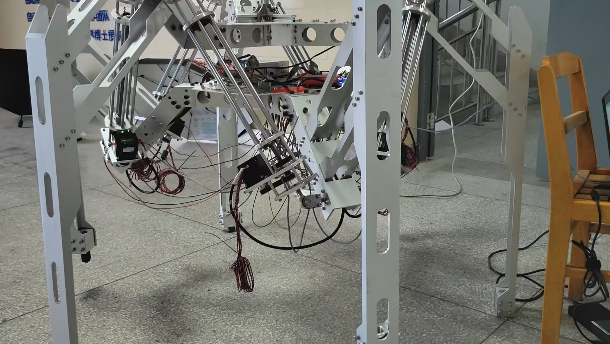

# StewartBot

____

## Introduce

This project is a bachelor's degree graduation project, which aims to verify the feasibility of parallel configuration of large-load robots.
The instructor is [Xu Kailiang](https://zdh.xaut.edu.cn/info/1043/1330.htm),

____

## To Do List

- [x] Framework Build  
- [x] CanOpen Nimotion Motor Control  
- [x] Muti Motor Control  
- [ ] Kinematic modeling  
- [ ] Structural design
- [ ] Simulation && Prototype verification  
- [ ] Binocular visual perception module  
- [ ] LiDAR mapping module
- [ ] Enclosed space SLAM

____

## Implementation

### Environment setup

| Items               | Option                      |  
| -----------         | -----------                 |  
|*System*             |**X86_64-Unbutu22.04**       |  
|*Software systems*   |**ROS2 humble**              |  
|*Hardware device*  |**NiMotion Motor-STM4248A**  |  
|*Communication*      |**CANopen**                  |  
|*Controller*         |**（Raspberry Pi）**                  |  

### Get source code  

<!-- - Create workspace

  ```shell
  mkdir -p robot_ws/src
  ```  

  ```shell
  cd robot_ws
  ```  

- Initialize the workspace  

  ```shell
  colcon build
  ```  

  ```shell
  cd src
  ```   -->

- Fetch source code  

  ```shell
  git clone -b feature/Nimotion git@github.com:BotAdv/StewartBot.git
  ```

- build env

  ```shell
  conda create -n stewart python=3.10 -y
  ```

- activate env

  ```shell
  conda activate stewart
  ```

- install packages

  ```shell
  pip install -r requirements.txt
  ```

[StewartBot-/feature/Nimotion](https://github.com/BotAdv/StewartBot/tree/feature/Nimotion)

____

## Principle

- schematic  
  
- robotic entity  
  

____

## Collaborators

**[@BotAdv](https://github.com/BotAdv)**  
**[@Lancee0812](https://github.com/Lancee0812)**  
**[@余文锦](https://github.com/余文锦)**  
<!-- **（余文锦）** -->  
____
