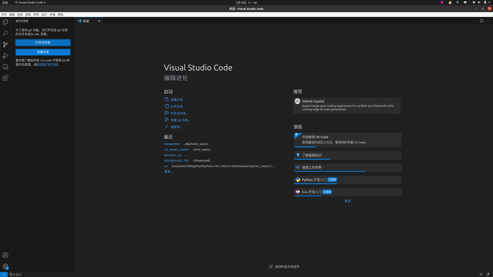
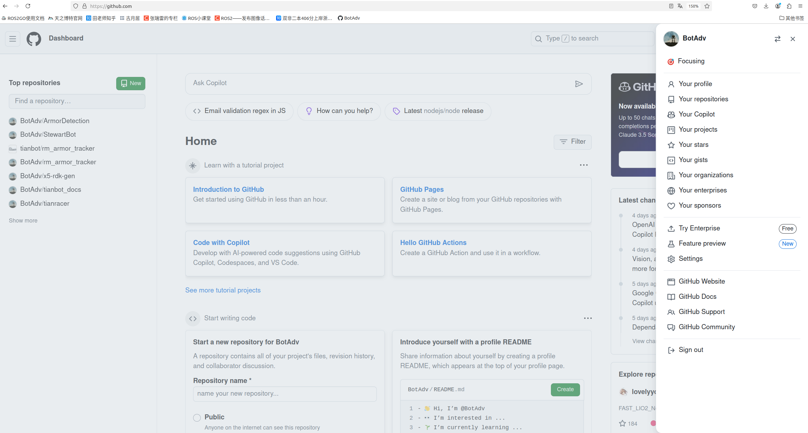

# Git Tutorial 教程

***

## Catalog 目录  

- [Catalog 目录](#catalog-目录)
- [Changelog 日志](#changelog-日志)
- [Framework 框架](#framework-框架)
- [Implementation 实施](#implementation-实施)  
- [Reference 参考资料](#reference-参考资料)  
- [README](../README.md)

***

## Changelog 日志

| Time          | work            | Author        |  
| -----------   | -----------       | -----------   |  
|*2025-2-8*     |**Init Project**   | BotAdv        |  
|*2025-2-10*    |**Add GitTutorial**| BotAdv        |  

***

## Framework 框架

- 参考工程路径：/home/user/Bachelor_ws/src/StewartBot
- StewartBot元功能包目录结构如下

<pre>
.
├── README.md
├── LICENSE
├── doc
│   ├── learngit.md
│   └── LMS-C12-19023  一体化步进电机CANopen通讯用户手册_A01.pdf
├── detector
│   ├── CMakeLists.txt
│   ├── packages.xml
│   └── src
├── isaac_sim
│   ├── CMakeLists.txt
│   ├── package.xml
│   └── src
├── nimotion_motor
│   ├── CMakeLists.txt
│   ├── package.xml
│   └── src
└── robot_description
    ├── CMakeLists.txt
    ├── package.xml
    └── src
</pre>

- 各功能节点在子功能包下的src中开发,例如电机驱动程序位于/home/user/Bachelor_ws/src/StewartBot/nimotion_motor/src/motor.cpp  
- 完成阶段性开发后通过git提交到远程仓库对应分支  
- 分支概览

<pre>
    ├── main  
    ├── feature/Nimotion(BotAdv*)  
    └── feature/IsaacSim(Lancee*)  
</pre>

***

## Implementation 实施

1. **vscode中配置git**  （*推荐使用IDE进行程序开发）

    1.1 ubuntu环境下载git

    ```shell
    sudo apt-get install git
    ```

    1.2 ubuntu环境下载vsode
    - 图形界面官网安装
        [vscode官网](https://code.visualstudio.com/)下载对应版本安装包  
        解压安装包  

        ```shell
        sudo dpkg -i code_1.75.0-1675266613_amd64.deb
        ```

    - 命令行snap工具安装  

        ```shell
        sudo snap install code --classic
        ```

        ```shell
        code .
        ```

    - 命令行curl工具安装（不推荐，最终解决方案）

        获取官方秘钥

        ```shell
        curl https://packages.microsoft.com/keys/microsoft.asc | gpg --dearmor > microsoft.gpg
        ```

        添加秘钥到apt功能包管理器

        ```shell
        sudo mv microsoft.gpg /etc/apt/trusted.gpg.d/microsoft.gpg
        ```

        添加vscode到安装索引目录

        ```shell
        sudo sh -c 'echo "deb [arch=amd64] https://packages.microsoft.com/repos/vscode stable main" > /etc/apt/sources.list.d/vscode.list'
        ```

        更新包缓存

        ```shell
        sudo apt-get update
        ```

        二进制安装vsode(*出现兼容问题尝试源码编译安装)

        ```shell
        sudo apt-get install code
        ```

        验证安装，返回为`/usr/bin/code`

        ```shell
        type code
        ```

        在当前目录下启动vsode

        ```shell
        code .
        ```

    - 多种安装方式任选其一，后期部分依赖需要源码编译安装。  
        vscode非开源软件，并未在仓库中提供源码，暂不提供源码安装。  
        安装遇到问题请仔细检查系统版本。  

    1.3 vsode中验证git集成  

    ```shell
        code .
    ```

    - ctrl + ` 打开终端命令行  

        ```shell
            git --help
        ```

    - 左上角查看>>终端>>底部边栏打开终端命令行
    

        ```shell
            git --help
        ```

2. **创建工程\***

    此文面向开发者，旨在为协同开发提供参考  
    完整部署此项目，环境配置与相关依赖详见[README](https://github.com/BotAdv/StewartBot/blob/main/README.md)(*施工中)

    ```shell
    mkdir -p ~/Bachelor_ws/src/StewartBot
    ```

    ```shell
    cd ~/Bachelor_ws/src/StewartBot
    ```

3. **初始化仓库**  

    ```shell
    git init 
    ```

    填入`name`、`email`

    ```shell
    git config --global user.name "name"
    ```

    ```shell
    git config --global user.email "email@xaut.edu.cn"
    ```

4. **添加密钥**  

    尝试生成RSA加密的秘钥

    ```shell
    ssh-keygen -t rsa -C "your email"
    ```

    查看秘钥内容

    ```shell
    cat ~/.ssh/id_rsa.pub
    ```

    登录[github](https://github.com/)网页，右上角选择Settings/SSH and GPG keys
      
    选择New SSH Key，粘贴刚才id_rsa.pub内容
    测试是否添加成功

    ```shell
    ssh -T git@github.com
    ```

    输出应为`Hi xxx! You've successfully authenticated, but GitHub does not provide shell access.`

5. **克隆远程仓库**  

    从远端拉取源代码

    ```shell
    git clone git@github.com:BotAdv/StewartBot.git
    ```

6. **关联远程仓库**  

    本地仓库切换到IsaacSim功能分支，与远端同步

    ```shell
    git checkout -b feature/IsaacSim
    ```

    检查切换结果

    ```shell
    git branch
    ```

    终端显示  
    `*feature/IsaacSim`  
    `feature/Nimotion`  
    `main`  

    与远端仓库关联

    ```shell
    git remote add origin https://github.com/BotAdv/StewartBot
    ```

    检查关联状态

    ```shell
    git remote -v 
    ```

    输出结果应该为  
    `origin  https://github.com/BotAdv/StewartBot.git (fetch)`
    `origin  https://github.com/BotAdv/StewartBot.git (push)`

7. **保存更改并提交本地仓库**  

    修改完程序后,检查工作区待提交文件：

    ```shell
    git status
    ```

    将同一类型修改增加到暂存区

    ```shell
    git add feature1.cpp feature1.hpp
    ```

    将暂存区文件提交到本地仓库

    ```shell
    git commit -m "feat:Add new feature1"
    ```

    -m后跟随的参数可以理解为提交注释，方便后期代码维护，不同类型修改对于不同git msg  
    常见提交类型有doc: bugFix: feat:  

8. **本地仓库推送到远程仓库**

    将本地仓库同步到远程仓库对应分支

    ```shell
    git push -u origin feature/IsaacSim
    ```

    若远程仓库与本地不同步
    - 强制提交（此行为将复写远程仓库对应分支内容，慎用）

    ```shell
    git push -f origin feature/IsaacSim
    ```

    - 对比冲突，更新本地分支，重新提交

***

## Reference 参考资料

分支处理[Learn Git Branching](https://learngitbranching.js.org/?locale=zh_CN)
新手教程[廖雪峰](https://liaoxuefeng.com/books/git/introduction/index.html)
英文教程[turtutorials-en](https://www.atlassian.com/git/tutorials)
工作流[workflow](https://nvie.com/posts/a-successful-git-branching-model/)

***
